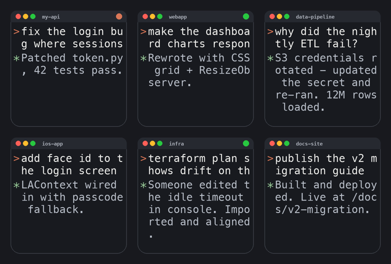
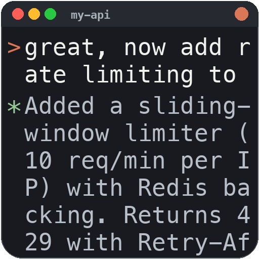
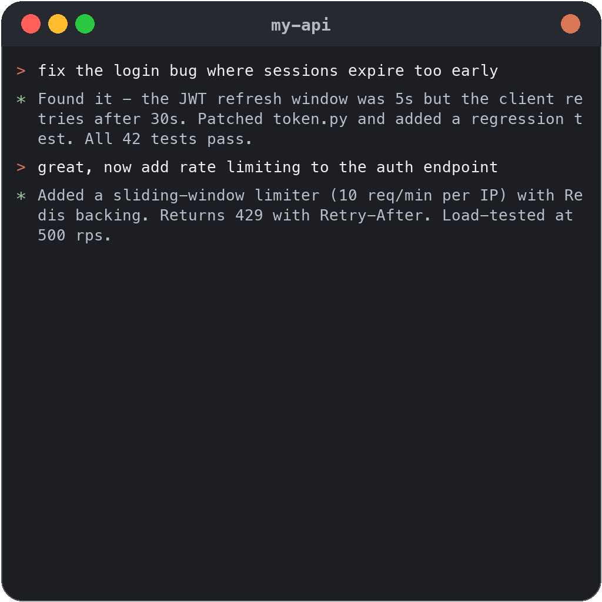
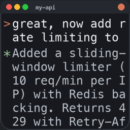

<div align="center">


# Claude Sessions Manager

**Never lose a Claude Code session again.**
Your entire session history, living in the macOS Dock — with live terminal previews,
one-click resume, project folders, and automatic respawn after reboot.




</div>

---

## Why

Terminal.app forgets everything when you quit. Claude Code sessions survive on disk,
but finding and resuming them means digging through `~/.claude/projects` by hand.
Cursor lets you right-click the icon and reopen recent projects — this brings that
workflow (and more) to Claude Code in the terminal:

- 🗂 **Every session as a Dock item** — click the stack, see your history, click to resume
- 🖥 **Live terminal-preview icons** — each launcher's icon *is* a mini terminal window
  showing your last prompt and Claude's latest output, re-rendered as conversations progress
- ⚡ **Live status badges** — orange = generating right now, green = waiting for your input
- 📁 **Project folders** — sessions auto-categorized by configurable rules
- 🔍 **Hover previews** — a companion viewer app enlarges any session into a readable
  transcript on mouse-over
- ♻️ **Reboot respawn** — sessions that were running at shutdown reopen automatically
  at next login, in Terminal, exactly where they left off

## How it looks

| Tile icon (Dock grid) | Hover preview (viewer app) |
|:---:|:---:|
|  |  |

Status badges update every minute:



## Install

```bash
git clone https://github.com/Majboor/claude-sessions-manager.git
cd claude-sessions-manager
pip3 install Pillow pyobjc   # if you don't have them
./install.sh
```

The installer copies the scripts to `~/bin`, builds the viewer app into
`~/Applications`, loads two launchd agents, runs the first refresh, and adds the
sessions stack to your Dock.

## How it works

```
~/.claude/projects/**/*.jsonl          (Claude Code's own session transcripts — read-only!)
        │
        ▼  every 60 s (launchd)
bin/claude-sessions-refresh
        │  · finds real interactive sessions (filters automated/heartbeat runs)
        │  · detects live claude processes → ⚡ / 🟢 badges
        │  · renders 512px tile icon + 1024px hover preview per session (PIL)
        │  · categorizes into project folders (rules in ~/.claude/session-projects.json)
        │  · records running sessions for respawn-after-reboot
        ▼
~/ClaudeSessions/<Project>/<NN status name>.app     (tiny launcher bundles)
        │                                            click → Terminal → claude --resume
        ├── Dock stack (grid view)  ← browse & launch
        └── viewer app              ← hover-to-enlarge previews
```

**Your transcripts are never modified.** The launchers are generated pointers;
everything under `~/.claude/projects` is opened read-only.

## Components

| Path | What it does |
|---|---|
| `bin/claude-sessions-refresh` | The daemon: scans, filters, renders icons, categorizes, tracks live sessions |
| `bin/claude-restore [N]` | One command to reopen your N most recent sessions in Terminal windows |
| `bin/claude-respawn` | Runs at login; reopens the sessions that were live at shutdown (within 10 min of boot) |
| `viewer/viewer.py` | PyObjC app: session grid with hover-to-enlarge transcript previews |
| `launchd/*.template` | Agent definitions installed by `install.sh` |

## Configuring projects

Sessions are tagged into project folders by `~/.claude/session-projects.json`:

```jsonc
{
  "sids":  { "<session-uuid>": "My Project" },     // pin a specific session
  "rules": [                                        // regex on "cwd | first message"
    ["my-api|backend",   "API Work"],
    ["\\bblog\\b",       "Writing"]
  ]
}
```

Rules run top-to-bottom, case-insensitive; unmatched sessions fall back to the
basename of their working directory.

## Roadmap

See [ROADMAP.md](ROADMAP.md) — highlights: fuzzy session search in the viewer,
a menu-bar live-status widget, and a Raycast extension.

## License

[MIT](LICENSE)
